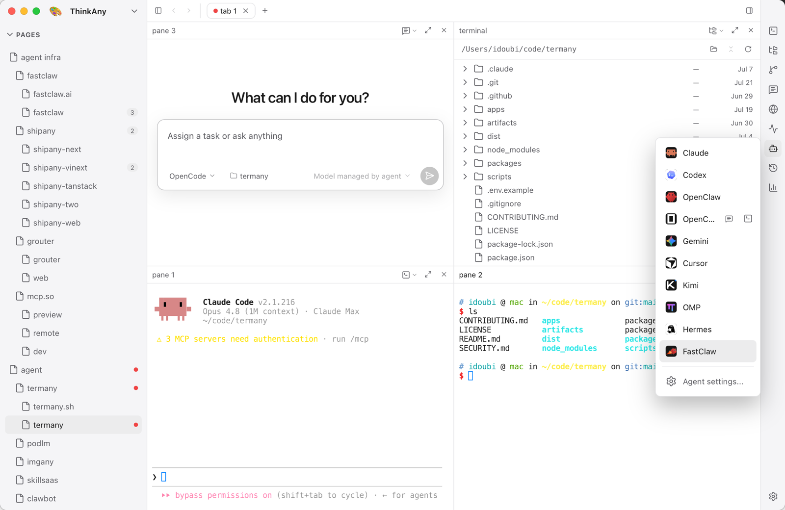
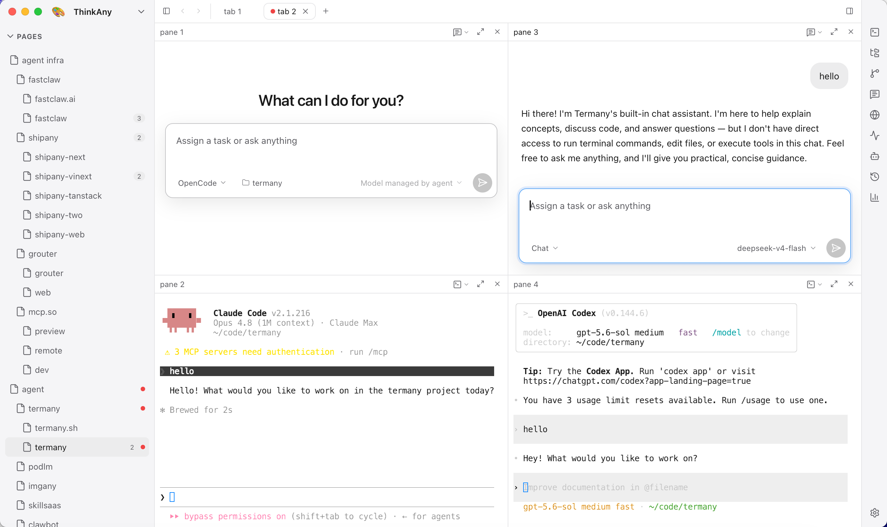
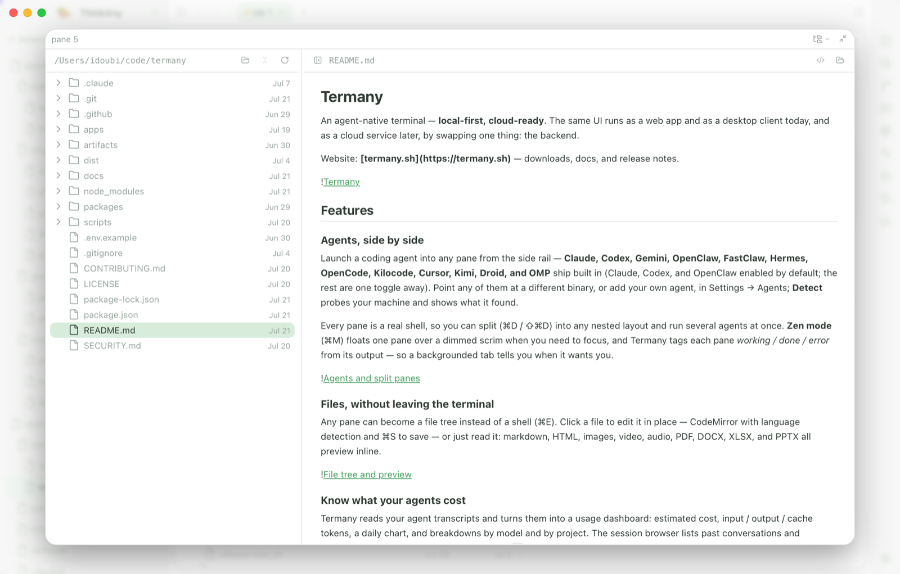
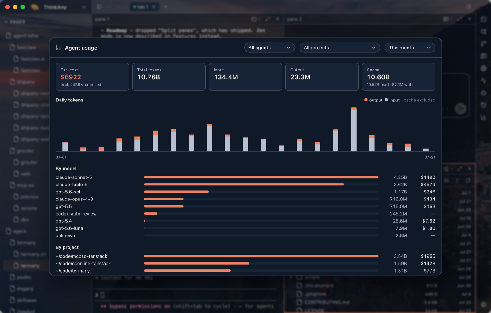
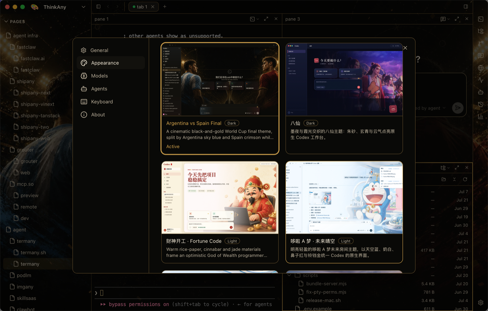

# Termany

An agent-native terminal — **local-first, cloud-ready**. The same UI runs as a web app and as a
desktop client today, and as a cloud service later, by swapping one thing: the backend.

Website: **[termany.sh](https://termany.sh)** — downloads, docs, and release notes.



## Features

### Agents, side by side

Launch a coding agent into any pane from the side rail — **Claude, Codex, Gemini,
OpenClaw, FastClaw, Hermes, OpenCode, Kilocode, Cursor, Kimi, Droid, and OMP** ship
built in (Claude, Codex, and OpenClaw enabled by default; the rest are one toggle
away). Point any of them at a different binary, or add your own agent, in
Settings → Agents; **Detect** probes your machine and shows what it found.

Every pane is a real shell, so you can split (⌘D / ⇧⌘D) into any nested layout and
run several agents at once. **Zen mode** (⌘M) floats one pane over a dimmed scrim
when you need to focus, and Termany tags each pane *working / done / error* from its
output — so a backgrounded tab tells you when it wants you.



### Files, without leaving the terminal

Any pane can become a file tree instead of a shell (⌘E). Click a file to edit it in
place — CodeMirror with language detection and ⌘S to save — or just read it: markdown,
HTML, images, video, audio, PDF, DOCX, XLSX, and PPTX all preview inline.



### Know what your agents cost

Termany reads your agent transcripts and turns them into a usage dashboard: estimated
cost, input / output / cache tokens, a daily chart, and breakdowns by model and by
project. The session browser lists past conversations and resumes any of them in a new
pane, already `cd`'d to the right project.

> Both read Claude and Codex transcripts today; other agents show as unsupported.



### Make it yours

Any [CodexThemes](https://codexthemes.ai) pack you've installed shows up in
Settings → Appearance with its artwork, and applies in one click — on top of the six
themes built in. Every one of the ~50 actions is rebindable in Settings → Keyboard, and
⌘P opens a command palette that searches both your commands and every page, tab, and
pane by name. UI available in English and 简体中文.



## Why it's shaped like this

```
┌──────────────────────────────────────────────┐
│  apps/web   React + xterm.js                   │  ← shared UI + (later) AI layer
│   Workspace ▸ VerticalTab ▸ HorizontalTab      │
├──────────────────────────────────────────────┤
│  packages/core   ITerminalBackend              │  ← the ONE seam
│    WebSocketBackend   (web / cloud)            │
│    LocalPtyBackend    (desktop, TODO)          │
├──────────────────────────────────────────────┤
│  apps/server   node-pty over WebSocket         │  ← local now; container-per-session later
└──────────────────────────────────────────────┘
```

Everything above `ITerminalBackend` is shared across web / desktop / cloud. To target a
new environment you write one more backend; the UI doesn't change.

## UI model — maximize the windows

- **Workspace** — far-left rail. A whole context (e.g. a client, a product).
- **Vertical tab** — left sidebar. A project / area inside the workspace.
- **Horizontal tab** — top strip. One live shell each.

Every horizontal tab is a persistent session: it keeps running (and keeps its scrollback)
while backgrounded — a build in one tab survives you switching away.

## Run (web, dev)

```bash
npm install          # builds node-pty natively (needs Xcode CLT on macOS)
pnpm dev:web         # starts the dev PTY server (:5175) + web (:15173)
```

Open http://localhost:15173.

## Desktop app

The desktop client wraps `apps/web` in [Tauri](https://tauri.app) and ships the
Node PTY/API server alongside it (a bundled Node runtime + `node-pty`), so it runs
fully offline with no separate install.

```bash
pnpm dev:desktop     # server (:5175) + web + the badged Tauri Dev app
```

### Build installers

Installers are produced in CI (`.github/workflows/`), one job per OS:

- **macOS** (`build.yml`) — signed + notarized `.dmg`, attached to a draft GitHub
  Release. Requires the `APPLE_*` repository secrets.
- **Windows** (`build-windows.yml`) — NSIS `.exe`, uploaded as a build artifact.
  No secrets required (unsigned).

Both rely on `scripts/bundle-server.mjs`, which assembles the Node server for the
host platform before the Tauri build. To build the macOS DMG locally, see
`scripts/release-mac.sh`.

## Configuration

Model providers are **BYOK** (bring your own key) — added at runtime in the app and
stored locally in `~/.termany/termany.db`; no keys live in this repo. Optional env vars:

| Variable            | Default        | Purpose                                  |
| ------------------- | -------------- | ---------------------------------------- |
| `TERMANY_PORT`      | `5174` release / `5175` dev | PTY/API server port            |
| `TERMANY_PASTE_DIR` | system temp    | Where pasted images are written          |
| `VITE_PTY_URL`      | `ws://localhost:5174` release / `:5175` dev | Web client → PTY WebSocket |
| `VITE_API_URL`      | follows `VITE_PTY_URL` | Web client → REST API                |

### Shortcuts

A starting set — all of them are rebindable in Settings → Keyboard.

| Key         | Action                        |
| ----------- | ----------------------------- |
| ⌘T          | New horizontal tab            |
| ⌘N          | New page (vertical tab)       |
| ⇧⌘N         | New workspace                 |
| ⌘W          | Close pane / tab              |
| ⌘D / ⇧⌘D    | Split pane right / down       |
| ⌘M          | Zen mode (maximize pane)      |
| ⌘E          | Toggle terminal / file view   |
| ⌘P          | Command palette / quick find  |
| ⌘F          | Find in scrollback            |
| ⌥⌘ ← ↑ ↓ →  | Move focus between panes      |
| ⌃⌘ ← ↑ ↓ →  | Resize the focused pane       |
| ⌘K          | Clear the pane                |

The desktop app can also summon (show / hide) its window from any app with a
system-wide hotkey. It ships off by default — every "good" chord is already
claimed somewhere (Spotlight, launchers, IMEs, media keys) — so pick your own
in Settings → Keyboard → System-wide.

## Roadmap (next)

- **AI layer** in `apps/web` — pipe terminal output to Claude for inline command
  suggestion / error diagnosis / natural-language execution.
- **`LocalPtyBackend`** — an in-process pty backend for desktop (today the desktop
  app talks to the bundled server over a local WebSocket).
- **Cloud**: move `apps/server` behind auth + a container-per-session sandbox.
- **Session reconnect**: survive page reload (server-side PTY persistence).

## Contributing

See [CONTRIBUTING.md](CONTRIBUTING.md) for dev setup and PR guidelines, and
[SECURITY.md](SECURITY.md) to report a vulnerability.

### Contributors

Thanks to everyone who has contributed to Termany:

[](https://github.com/thinkany-ai/termany/graphs/contributors)

## License

[AGPL-3.0](LICENSE) © 2026 ThinkAny, LLC. Network use is distribution: if you run a modified
version as a service, you must offer users its source. For commercial licensing
outside the AGPL, contact support@thinkany.ai.

---

[termany.sh](https://termany.sh) is built with [ShipAny](https://shipany.ai).
